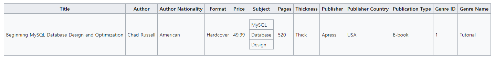

# Database Design

### DB Normalization

- Data 중복이 위험한 이유
  - Update anomaly
  - Insertion anomaly
  - Deletion anomaly

=>  중복된 속성을 지닌 데이터들 중 어떤 데이터를 건드려야할지 모르니까!

-  `Key Attr`: 하나의 row를 unique하게 결정해주는 속성

- `Functional Dependency` : 함수의 수학적 정의와 같이 `M:1`관계로 mapping되는 것을 의미

  > 전화번호가 세 부분으로 구성되어 있을 때,
  >
  > first: `02`
  >
  > second: `880`
  >
  > third: `1331`
  >
  > 세가지 속성이 uniquely determine할 수 있는 전화번호는 GSDS의 전화번호이다.

- `DB Normalization`: `Key Attr`를 통해 `Functional Dependency`를 DB에 부여하는 작업

### Normalization

- 1970년 Codd는 `first order logic`에 기반을 둔 `universal data sub language`에 의해 데이터의 조작과 검색을 가능하기 위해 `1NF`를 정의
  - The objectives of normalization beyond 1NF
    1. 고려되지 않은 삽입, 갱신, 삭제 의존에서부터 관계의 집합을 배제
    2. 새로운 자료형이 나타날 때, 관계들의 집합의 재구성이 필요성을 낮추고, 그로 인하여 응용 프로그램의 생명주기를 연장
    3. 관계 모델이 사용자에게 더 많은 정보를 전달할 수 있도록
    4. 관계들의 집합을 query statistics로부터 중립적이게 한다. (들은 시간이 지남에 따라 변경되기 때문)

### Process of DB Normalization

**예시를 통해 Normalization 과정 설명**

관계 모델이 되기 위해서는 하나의 테이블은 반드시 하나의 `primary key`를 가지고 있어야 한다. `primary key`는 하나의 행을 uniquely 구분 지을 수 있어야 한다.

예시에서 주어진 책 정보에 `primary key`로 사용할 수 있는 ISBN번호 추가

#### 1NF (1st Normal Form)

- <u>각각의 column은 반드시 하나의 값만을 가지고 있어야 한다.</u>
- value들의 집합이나 기록들이 들어가서는 안된다. (위 그림의 Subject)

**1NF에 따라 Subject를 따로 테이블을 만들어 분리**

#### 2NF (2nd Normal Form)

- 1NF를 만족해야 한다.
- <u>후보키의 원소가 아닌 속성(`Non-prime attribute`)들이 반드시 후보키 속성들의 전체 집합에 dependent해야 한다. 후보키 속성들 중 일부에만 dependent하면 안된다.</u>

- 위의 예시에서 Book table은 복합키({`Title`, `Format`})가 기본키이자 후보키이다.

- 복합키 구성요소를 제외한 다른 모든 attribute 들이 `Title`에 dependent하지만 `Price`만이 `Format`에 dependent함으로 2NF를 만족시키고 column 상의 중복을 제거하기 위해 **후보키에 속하지 않는 모든 속성들은 반드시 전체 후보키에 dependent해야 한다.**
- 이를 위해 위의 예시에서 `Title`을 primary key로 삼고 `Title`에만 dependent한 속성들을 따로 분리하여 하나의 테이블을 만든 다음, `Price` 속성을 {`Title`, `Price`} 복합키로 가지는 테이블로 만들어 준다. 해당 작업의 결과는 아래와 같다.

**Price만 분리하여 Format-Price 테이블에 따로 정의**

#### 3NF (3rd Normal Form)

- 2NF를 만족해야 한다.

- primary key를 제외한 attribute들 간에 이행적 함수 종속이 없어야 한다. 
- "A relation is in third normal form if there is no transitive dependency for non-prime attributes"

- Book 테이블에서 `Author Nationality`는  `Author`에 함수적 종속성을 띠고, 또한 `Author`는 `Title`에 함수적 종속성을 띠고 있다.  비슷한 경우가 `Genre Name`과 `Genre`에서도 발생하고 있어서 3NF를 만족시키지 못한다.
- 이를 해결하기 위해서는 아래와 같이 `Author`와 `Genre`테이블을 따로 분리하여 만들어 주면 된다.

### Reference

[DB Normalization Wikipedia](https://en.wikipedia.org/wiki/Database_normalization)

[함수 종속성 참고](https://untitledtblog.tistory.com/125)

