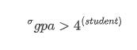

# Relational Algebra

## Relational Query Languages

- Query Languages: DB에서 데이터의 조작과 조회를 할 수 있게 해주는 언어
- 관계형 모델은 간단하고 강력한 QL을 지원한다
  - 대수/논리에 기반한 강력한 형식 기초
  - 최적화 가능

## Formal Relational Query Languages

- 두 개의 mathematical Query Language가 현재 우리가 사용하는 SQL과 그것을 실행시키는 데에 기반이 되었다.

  => `Relational Algebra`, `Realtional Calculus`

- `Relational Aglebra(관계대수)`: 집합론과 1차 논리에 기반하여 관계로 표현된 데이터를 취급하는 대수적인 연산 체계 (**절차적**)

- `Relational Calculus(관계논리)`: 관계형 데이터베이스의 관계 모델에서 **선언적**인 방법으로 관계로 표현된 데이터 처리, 컴퓨터 과학의 연산 체계

### Relational Algebra

- 모든 관계대수 연산자는 하나 혹은 두 개의 `relational instance`를 가진다.
- 관계대수의 표현식은 재귀적으로 relation이 되기 위해 정의된다.
  - 관계대수의 표현식의 결과 또한 하나의 relation  => 다른 연산자의 결과로서의 relation
  
  

### Relational Algebra Operations

- 기초 연산자
  - Selection($\sigma$): relation으로 부터 row들로 구성된 subset을 선택
  -  Projection($\pi$): relation으로 부터 원하지 않는 column들을 제거
  -  Cross-product/ Cartesian-product($\times$): 두 relation instance의 곱집합
  -  Set-difference($-$): 두  relation instance의 차집합
  -  Union($\bigcup$): 두  relation instance의 합집합
- 파생 연산자
  - Intersection(교집합), join(조인), division(분해, subset인 relation이 포함된 인스턴스만 다시 리턴), rename(column이름 변경 -> 충돌방지)
- 각 연산자들의 리턴들도 relation이기 때문에 연산들끼리 결합할 수 있다.

#### Projection

- Projection list에 있지 않은 attribute(column)들을 삭제

- 결과로 나온 relational instance의 schema는 projection list와 정확히 일치

- projection list는 반드시 중복제거를 해야 사용할 수 있다.
  - "As Martin suggested, <u>Relational Algebra deals with sets</u>, projection, selection, union, intersection are all SET operations."

- 예시
  
  
  
  
  
  이러한 relational expression이 존재할 때, 다음 식의 뜻은 `student`라는 relation에서 `student_name`, `gpa`라는 두 속성을 제외한 나머지 속성들을 삭제하고 결과를 리턴하라는 의미이다. 여기서 $student\_name, gpa$ 가 projection list에 해당한다.

#### Selection

- 선택 조건을 만족하는 row들을 선택

- projection에서 설명했듯이, 연산자들의 리턴들이 모두 set이므로 selection 또한 그 결과에 duplicates가 없다

- 결과로 나온 relational instance의 schema는 input relation의 schema와 동일 (필터링만 했으니까!)

- 선택 조건

  - simple conditions: 단순히 변수나 상수를 비교

    example)
    
    
    
     gpa > 4인 학생들만 조회한 relational instance가 결과로 리턴

  - complex conditons: `AND`나 `OR`연산자를 통해 simple condition들을 결합

    example)
    
    
    
    gpa > 4 인 학생들만 조회한 relational instance가 결과에서 `student_name`과 `gpa`만 출력

####  Union,  Intersection, Set-difference

- 이 세 가지 집합 연산자를 사용하기 위해서는 `union-compatible`한 input relation 2개가 주어져야 한다.
- `union-compatible`
  - 동일한 수의 fields(column) 수
  - `corresponding`하는 field가 동일한 type의 데이터를 가지고 있어야 함

#### Cross-Product

- 벡터의 내적연산의 relation 버전

- 연산의 결과로 나오는 relational instance는 두 개의 input relational instance의 모든 column을 상속받는다.(if possible)

- 만약 두 개의 input에 동일한 column이 존재한다면 충돌이 발생

- 이를 해결하기 위해 `rename` operator를 사용

  - example
    
    
    
    1, 5번째 column의 이름들이 중복된 경우, 각각을 id1, id2로 rename해줌으로써 충돌을 해결

    

### Reference

- [관계 데이터 연산](https://m.blog.naver.com/k97b1114/140152644090)

- [Why Projection Operator in relational algebra eliminates duplicates?](https://stackoverflow.com/questions/28518772/why-projection-operator-in-relational-algebra-eliminates-duplicates)

- [Flatinum 블로그](https://chartworld.tistory.com/12)

